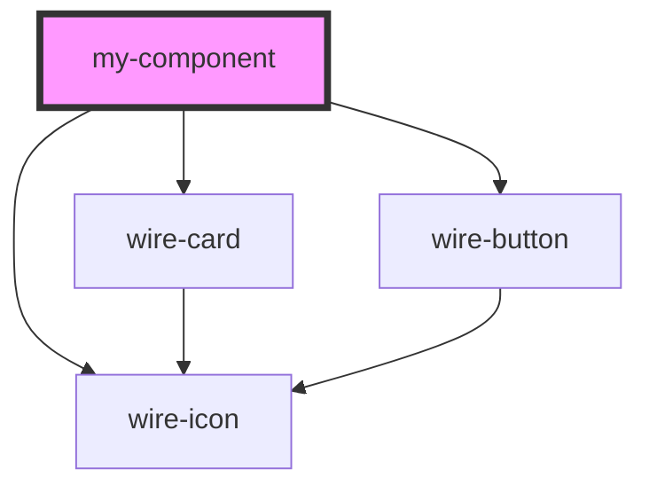

# my-component

<!-- Auto Generated Below -->

## Dependencies

### Depends on

- [wire-card](../wire-card)
- [wire-button](../wire-button)
- [wire-icon](../wire-icon)

### Graph

----------------------------------------------

*Built with [StencilJS](https://stenciljs.com/)*
