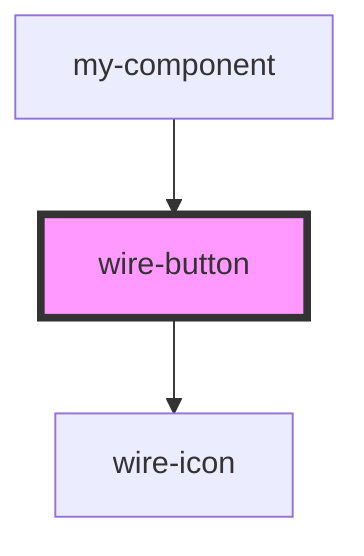

# wire-button

<!-- Auto Generated Below -->

## Properties

| Property       | Attribute       | Description | Type                                     | Default     |
| -------------- | --------------- | ----------- | ---------------------------------------- | ----------- |
| `color`        | `color`         |             | `"primary" \| "secondary" \| "tertiary"` | `'primary'` |
| `disabled`     | `disabled`      |             | `boolean`                                | `false`     |
| `icon`         | `icon`          |             | `string \| undefined`                    | `undefined` |
| `iconPosition` | `icon-position` |             | `"left" \| "right"`                      | `'left'`    |
| `label`        | `label`         |             | `string \| undefined`                    | `undefined` |
| `loading`      | `loading`       |             | `boolean`                                | `false`     |
| `size`         | `size`          |             | `"large" \| "medium" \| "small"`         | `'medium'`  |
| `variant`      | `variant`       |             | `"filled" \| "outline"`                  | `'filled'`  |

## Dependencies

### Used by

 - [my-component](../my-component)

### Depends on

- [wire-icon](../wire-icon)

### Graph

----------------------------------------------

*Built with [StencilJS](https://stenciljs.com/)*
