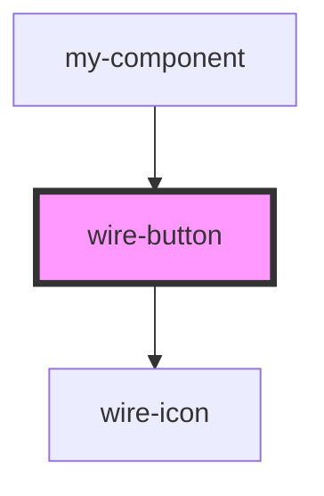

# wire-button

<!-- Auto Generated Below -->

## Properties

| Property              | Attribute               | Description | Type                                                        | Default     |
| --------------------- | ----------------------- | ----------- | ----------------------------------------------------------- | ----------- |
| `bgDark`              | `bg-dark`               |             | `string \| undefined`                                       | `undefined` |
| `bgLight`             | `bg-light`              |             | `string \| undefined`                                       | `undefined` |
| `buttonType`          | `button-type`           |             | `"primary" \| "secondary" \| "tertiary"`                    | `'primary'` |
| `color`               | `color`                 |             | `"blue" \| "gradient" \| "white" \| undefined`              | `undefined` |
| `disabled`            | `disabled`              |             | `boolean`                                                   | `false`     |
| `glow`                | `glow`                  |             | `boolean \| undefined`                                      | `undefined` |
| `icon`                | `icon`                  |             | `string \| undefined`                                       | `undefined` |
| `iconPosition`        | `icon-position`         |             | `"left" \| "right"`                                         | `'left'`    |
| `label`               | `label`                 |             | `string \| undefined`                                       | `undefined` |
| `loading`             | `loading`               |             | `boolean`                                                   | `false`     |
| `size`                | `size`                  |             | `"large" \| "medium" \| "small"`                            | `'medium'`  |
| `theme`               | `theme`                 |             | `"dark" \| "light" \| undefined`                            | `undefined` |
| `useSystemPreference` | `use-system-preference` |             | `boolean`                                                   | `false`     |
| `variant`             | `variant`               |             | `"gradient" \| "outline" \| "solid" \| "text" \| undefined` | `undefined` |

## Dependencies

### Used by

 - [my-component](../my-component)

### Depends on

- [wire-icon](../wire-icon)

### Graph

----------------------------------------------

*Built with [StencilJS](https://stenciljs.com/)*
