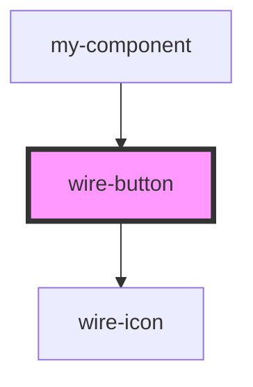

# wire-button

<!-- Auto Generated Below -->

## Properties

| Property       | Attribute       | Description | Type                                                        | Default     |
| -------------- | --------------- | ----------- | ----------------------------------------------------------- | ----------- |
| `color`        | `color`         |             | `"blue" \| "gradient" \| "white" \| undefined`              | `undefined` |
| `disabled`     | `disabled`      |             | `boolean`                                                   | `false`     |
| `glow`         | `glow`          |             | `boolean \| undefined`                                      | `undefined` |
| `icon`         | `icon`          |             | `string \| undefined`                                       | `undefined` |
| `iconPosition` | `icon-position` |             | `"left" \| "right"`                                         | `'left'`    |
| `label`        | `label`         |             | `string \| undefined`                                       | `undefined` |
| `loading`      | `loading`       |             | `boolean`                                                   | `false`     |
| `role`         | `role`          |             | `"primary" \| "secondary" \| "tertiary"`                    | `'primary'` |
| `size`         | `size`          |             | `"large" \| "medium" \| "small"`                            | `'medium'`  |
| `variant`      | `variant`       |             | `"gradient" \| "outline" \| "solid" \| "text" \| undefined` | `undefined` |

## Dependencies

### Used by

 - [my-component](../my-component)

### Depends on

- [wire-icon](../wire-icon)

### Graph

----------------------------------------------

*Built with [StencilJS](https://stenciljs.com/)*
