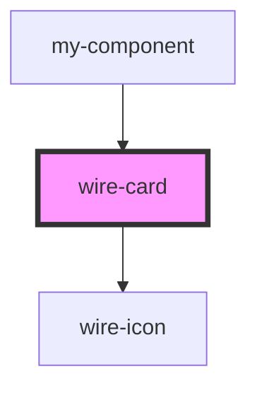

# wire-card

<!-- Auto Generated Below -->

## Properties

| Property   | Attribute   | Description | Type                                                  | Default     |
| ---------- | ----------- | ----------- | ----------------------------------------------------- | ----------- |
| `actions`  | --          |             | `HTMLElement \| undefined`                            | `undefined` |
| `border`   | `border`    |             | `"default" \| "featured" \| "primary" \| "secondary"` | `'default'` |
| `heading`  | `heading`   |             | `string \| undefined`                                 | `undefined` |
| `icon`     | `icon`      |             | `string \| undefined`                                 | `undefined` |
| `iconSize` | `icon-size` |             | `"large" \| "medium" \| "small" \| number`            | `'medium'`  |
| `shadow`   | `shadow`    |             | `boolean`                                             | `true`      |
| `theme`    | `theme`     |             | `"dark" \| "light" \| undefined`                      | `undefined` |

## Dependencies

### Used by

 - [my-component](../my-component)

### Depends on

- [wire-icon](../wire-icon)

### Graph

----------------------------------------------

*Built with [StencilJS](https://stenciljs.com/)*
