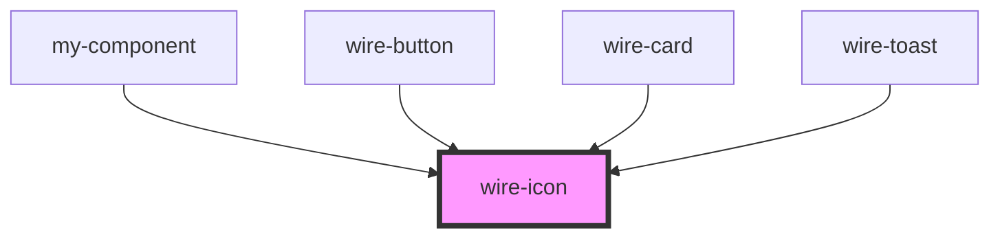

# wire-icon

<!-- Auto Generated Below -->

## Properties

| Property            | Attribute | Description | Type                                       | Default     |
| ------------------- | --------- | ----------- | ------------------------------------------ | ----------- |
| `color`             | `color`   |             | `string \| undefined`                      | `undefined` |
| `name` _(required)_ | `name`    |             | `string`                                   | `undefined` |
| `size`              | `size`    |             | `"large" \| "medium" \| "small" \| number` | `'medium'`  |

## Dependencies

### Used by

 - [my-component](../my-component)
 - [wire-button](../wire-button)
 - [wire-card](../wire-card)
 - [wire-toast](../wire-toast)

### Graph

----------------------------------------------

*Built with [StencilJS](https://stenciljs.com/)*
