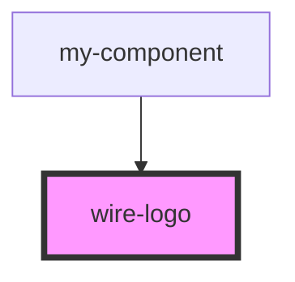

# wire-logo

The Wire Logo component displays the Wire brand logo in different modes.

## Usage

```html
<!-- Default (full-color) logo -->
<wire-logo></wire-logo>

<!-- Light mode logo (for dark backgrounds) -->
<wire-logo mode="light-mode"></wire-logo>

<!-- Dark mode logo (for light backgrounds) -->
<wire-logo mode="dark-mode"></wire-logo>

<!-- Custom size -->
<wire-logo width="200" height="50"></wire-logo>
```

<!-- Auto Generated Below -->


## Properties

| Property | Attribute | Description                                                                                                                                                                                                                   | Type                                          | Default        |
| -------- | --------- | ----------------------------------------------------------------------------------------------------------------------------------------------------------------------------------------------------------------------------- | --------------------------------------------- | -------------- |
| `mode`   | `mode`    | The mode of the logo to display - 'full-color': The full color version of the logo - 'light-mode': Light mode version of the logo (for dark backgrounds) - 'dark-mode': Dark mode version of the logo (for light backgrounds) | `"dark-mode" \| "full-color" \| "light-mode"` | `'full-color'` |
| `size`   | `size`    | The size of the logo - 'small': Small size logo (100px width) - 'medium': Medium size logo (150px width) - 'large': Large size logo (200px width)                                                                             | `"large" \| "medium" \| "small"`              | `'medium'`     |
| `width`  | `width`   | Optional width override in pixels Height will automatically adjust to maintain aspect ratio                                                                                                                                   | `number \| undefined`                         | `undefined`    |


## Dependencies

### Used by

 - [my-component](../my-component)

### Graph


----------------------------------------------

*Built with [StencilJS](https://stenciljs.com/)*
