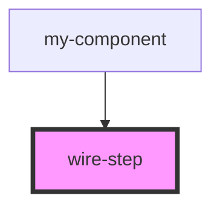

# wire-step

<!-- Auto Generated Below -->

## Properties

| Property             | Attribute     | Description                          | Type                                               | Default     |
| -------------------- | ------------- | ------------------------------------ | -------------------------------------------------- | ----------- |
| `active`             | `active`      | Whether the step is currently active | `boolean`                                          | `false`     |
| `completed`          | `completed`   | Whether the step has been completed  | `boolean`                                          | `false`     |
| `description`        | `description` | Optional description for the step    | `string \| undefined`                              | `undefined` |
| `disabled`           | `disabled`    | Whether the step is disabled         | `boolean`                                          | `false`     |
| `id` _(required)_    | `id`          | Unique identifier for the step       | `string`                                           | `undefined` |
| `title` _(required)_ | `title`       | The title of the step                | `string`                                           | `undefined` |
| `validate`           | --            | Validation function for the step     | `(() => boolean \| Promise<boolean>) \| undefined` | `undefined` |

## Events

| Event           | Description                              | Type                                             |
| --------------- | ---------------------------------------- | ------------------------------------------------ |
| `stepCompleted` | Event emitted when the step is completed | `CustomEvent<string>`                            |
| `stepValidated` | Event emitted when the step is validated | `CustomEvent<{ id: string; isValid: boolean; }>` |

## Dependencies

### Used by

 - [my-component](../my-component)

### Graph

----------------------------------------------

*Built with [StencilJS](https://stenciljs.com/)*
