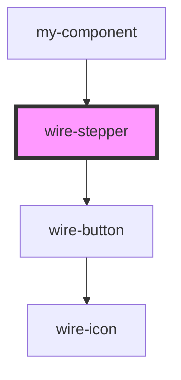

# wire-stepper

<!-- Auto Generated Below -->

## Properties

| Property              | Attribute               | Description                              | Type                             | Default        |
| --------------------- | ----------------------- | ---------------------------------------- | -------------------------------- | -------------- |
| `bgDark`              | `bg-dark`               |                                          | `string \| undefined`            | `undefined`    |
| `bgLight`             | `bg-light`              |                                          | `string \| undefined`            | `undefined`    |
| `border`              | `border`                | Border                                   | `boolean`                        | `true`         |
| `cancelButtonText`    | `cancel-button-text`    |                                          | `string`                         | `'Cancel'`     |
| `currentStep`         | `current-step`          | Initial step index                       | `number`                         | `0`            |
| `customCssClass`      | `custom-css-class`      | Optional custom CSS class                | `string \| undefined`            | `undefined`    |
| `finishButtonText`    | `finish-button-text`    |                                          | `string`                         | `'Finish'`     |
| `isLinear`            | `is-linear`             | Navigation mode: linear or non-linear    | `boolean`                        | `true`         |
| `nextButtonText`      | `next-button-text`      | Button label customization               | `string`                         | `'Next'`       |
| `orientation`         | `orientation`           | Orientation mode: horizontal or vertical | `"horizontal" \| "vertical"`     | `'horizontal'` |
| `orientationVertical` | `orientation-vertical`  |                                          | `"center" \| "sticky" \| "top"`  | `'top'`        |
| `prevButtonText`      | `prev-button-text`      |                                          | `string`                         | `'Back'`       |
| `showButtons`         | `show-buttons`          |                                          | `boolean`                        | `true`         |
| `showCancelButton`    | `show-cancel-button`    |                                          | `boolean`                        | `false`        |
| `stepNavigation`      | `step-navigation`       |                                          | `boolean`                        | `false`        |
| `stepNumberStyle`     | `step-number-style`     | Step Options                             | `"circles" \| "numbers"`         | `'numbers'`    |
| `theme`               | `theme`                 | Theme configuration                      | `"dark" \| "light" \| undefined` | `undefined`    |
| `useSystemPreference` | `use-system-preference` |                                          | `boolean`                        | `false`        |

## Events

| Event         | Description | Type                  |
| ------------- | ----------- | --------------------- |
| `cancelled`   |             | `CustomEvent<void>`   |
| `finished`    |             | `CustomEvent<void>`   |
| `stepChanged` |             | `CustomEvent<number>` |

## Dependencies

### Used by

 - [my-component](../my-component)

### Depends on

- [wire-button](../wire-button)

### Graph

----------------------------------------------

*Built with [StencilJS](https://stenciljs.com/)*
