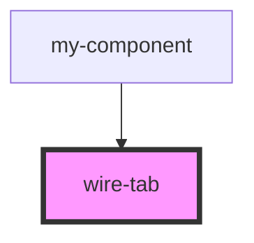

# wire-tab

<!-- Auto Generated Below -->

## Properties

| Property           | Attribute  | Description | Type      | Default     |
| ------------------ | ---------- | ----------- | --------- | ----------- |
| `active`           | `active`   |             | `boolean` | `false`     |
| `disabled`         | `disabled` |             | `boolean` | `false`     |
| `tab` _(required)_ | `tab`      |             | `string`  | `undefined` |

## Events

| Event      | Description | Type                  |
| ---------- | ----------- | --------------------- |
| `tabClick` |             | `CustomEvent<string>` |

## Dependencies

### Used by

 - [my-component](../my-component)

### Graph

----------------------------------------------

*Built with [StencilJS](https://stenciljs.com/)*
