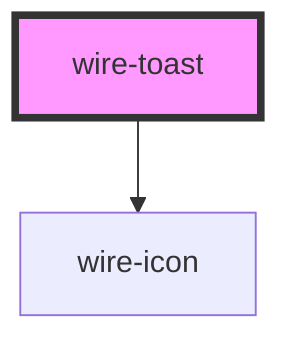

# wire-toast

<!-- Auto Generated Below -->

## Properties

| Property   | Attribute  | Description | Type                         | Default          |
| ---------- | ---------- | ----------- | ---------------------------- | ---------------- |
| `position` | `position` |             | `"bottom-right" \| "center"` | `'bottom-right'` |

## Dependencies

### Depends on

- [wire-icon](../wire-icon)

### Graph

----------------------------------------------

*Built with [StencilJS](https://stenciljs.com/)*
